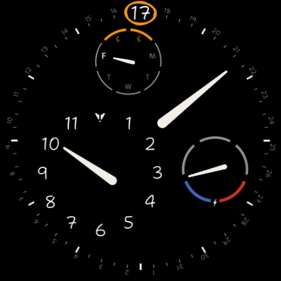
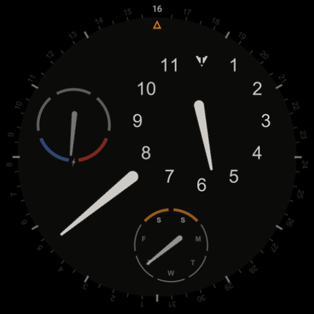

# Orrery

[](https://github.com/johnhringiv/orrery/actions/workflows/android.yml)

An orbital watch face for Wear OS, built in the declarative [Watch Face Format](https://developer.android.com/training/wearables/wff) (no code, just XML — Google's renderer handles power, ambient, and burn-in optimization).

Like an orrery, everything moves: three satellites ride circular orbits around a matte black dial, completing one revolution per hour while staying upright —

- an **hour disc** that counter-rotates so the current hour always sits beneath its tick, signed with an IV burgee at the 12 position
- a **day-of-week gauge** with the weekend arc highlighted
- a **battery gauge** — needle over a five-segment scale, red at empty, blue at full

A long tapered blade reads minutes against the flange tick ring, and the date ring rotates today's numeral to 12 o'clock, highlighted beneath a fixed pointer.

| Interactive                                      | Ambient (AOD)                            |
| ------------------------------------------------ | ---------------------------------------- |
|  |  |

## Install (sideload)

Grab the APK from [Releases](https://github.com/johnhringiv/orrery/releases), then:

1. **On the watch** — enable developer mode: Settings → System → About → tap **Build number** 7 times. Then Settings → **Developer options** → enable **ADB debugging** and **Wireless debugging** (watch and computer on the same Wi-Fi).
2. **Pair (one time)** — on the watch open Wireless debugging → **Pair new device**; on your computer:
   ```
   adb pair <ip>:<pairing-port> <6-digit-code>
   ```
3. **Connect and install** — the main Wireless debugging screen shows a different port:
   ```
   adb connect <ip>:<port>
   adb install Orrery-v<version>.apk
   ```
4. Long-press the current watch face → pick **Orrery**.

Needs Wear OS 5.1+ (minSdk 35, WFF v3 — required by the blend modes and part transforms the orbits use). `adb` ships with [Android platform-tools](https://developer.android.com/tools/releases/platform-tools).

## Building from source

```
./gradlew :watchface:assembleDebug      # debug build
./gradlew :watchface:assembleRelease    # release (signed if keystore.properties exists, else unsigned)
```

Requires JDK 21 and the Android SDK (compileSdk 36). Release signing reads `keystore.properties` at the repo root (gitignored); CI restores it from the `KEYSTORE_B64` / `KEYSTORE_PASSWORD` secrets.

There is no live preview for WFF: iterate by building and installing on a watch or emulator. CI runs the [WFF format validator and memory footprint check](https://github.com/google/watchface) on every build.

Design references live in `docs/`: [font-specimen.html](docs/font-specimen.html) compares rounded-sans candidates for the dial numerals against the current Arial, at true asset scale (fonts embedded — open it locally in any browser).

After cloning, enable the repo hooks (auto-formats Markdown with Prettier on commit; CI enforces):

```
git config core.hooksPath .githooks
```

## Versioning

- **`versionCode`** (integer) — bumped on **every change** pushed to a feature branch; CI rejects PRs where it hasn't increased past `main`.
- **`versionName`** (e.g. `0.1`) — bumped **once per PR to `main`**; CI enforces it differs from `main`. Merges to `main` automatically publish a GitHub release with the APK.

## License

Apache License 2.0 — see [LICENSE](LICENSE).

Sibling project: [meridian](https://github.com/johnhringiv/meridian), a clean digital face with a battery rim arc.
